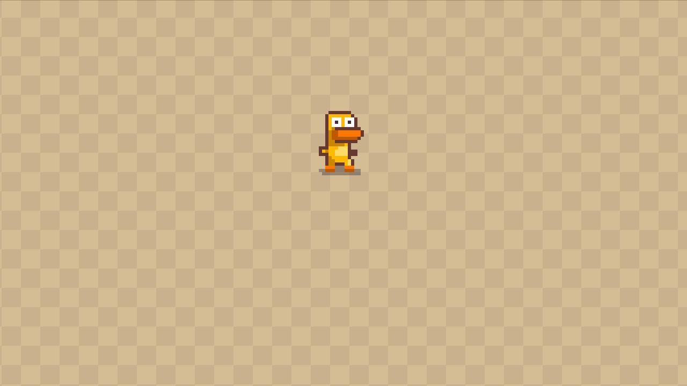

Hi there, I'm Björn Hjorth 👋

I like combining the web and game development, if you like what you see please do not be a stranger and say "Hi" on Twitter [@colorsofcode](https://twitter.com/colorsofcode)


<a href="https://javascript-game-development-css-animation.stackblitz.io">View Demo on StackBlitz⚡️</a>
·
<a href="https://stackblitz.com/edit/javascript-game-development-css-animation">Edit Demo on StackBlitz⚡️</a>

<a href="https://github.com/colorsofcode/javascript-game-development-css-amimation/issues">Report Bug</a>

<div align="center">
   
</div>


<!-- ABOUT -->
## About The Project

Small example showing how you can make game sprite animations using CSS with Javascript movement.

<!-- PREREQUISITES -->
## Prerequisites

* Node
* Npm

<!-- STARTING -->
## Getting started 

1. Clone the repo
   ```sh
   git clone https://github.com/colorsofcode/javascript-game-development-css-amimation.git
   ```
2. Move to the new directory
    ```sh
    cd javascript-game-development-css-amimation
    ```
3. Install development dependencies
   ```sh
   npm install
   ```
4. Start up the development environment
   ```sh
   npm run dev   
   
<!-- CONTACT -->
## Contact

Björn Hjorth - [@colorsofcode](https://twitter.com/colorsofcode)

Homepage: [https://colorsofcode.com](https://colorsofcode.com)

<!-- LICENSE -->
## License

Distributed under the MIT License. See `LICENSE` for more information.

<!-- ACKKNOWLEDGE -->
## Acknowledgments
